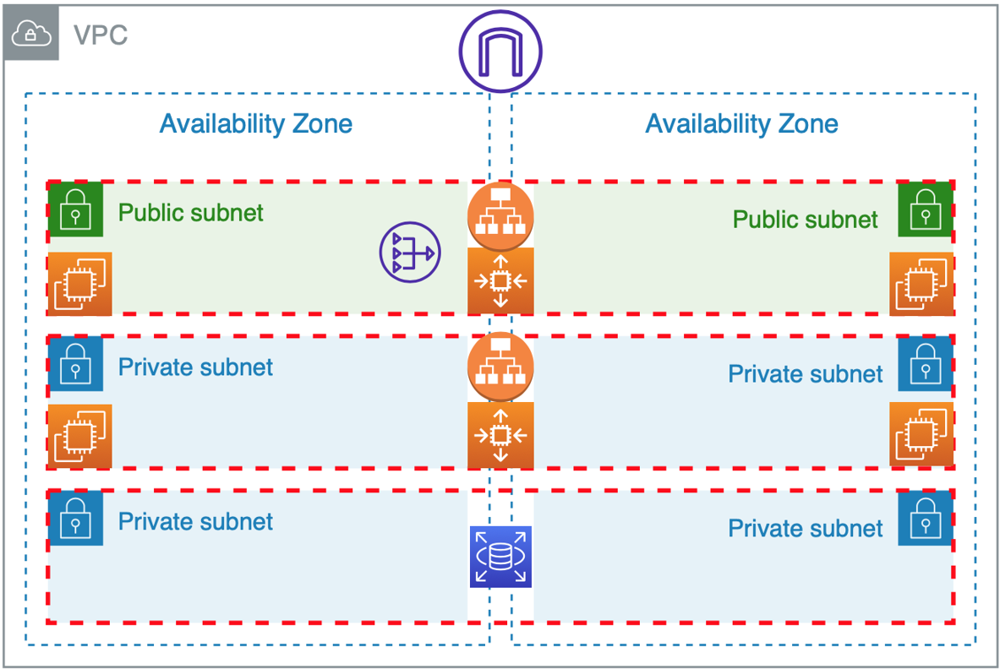
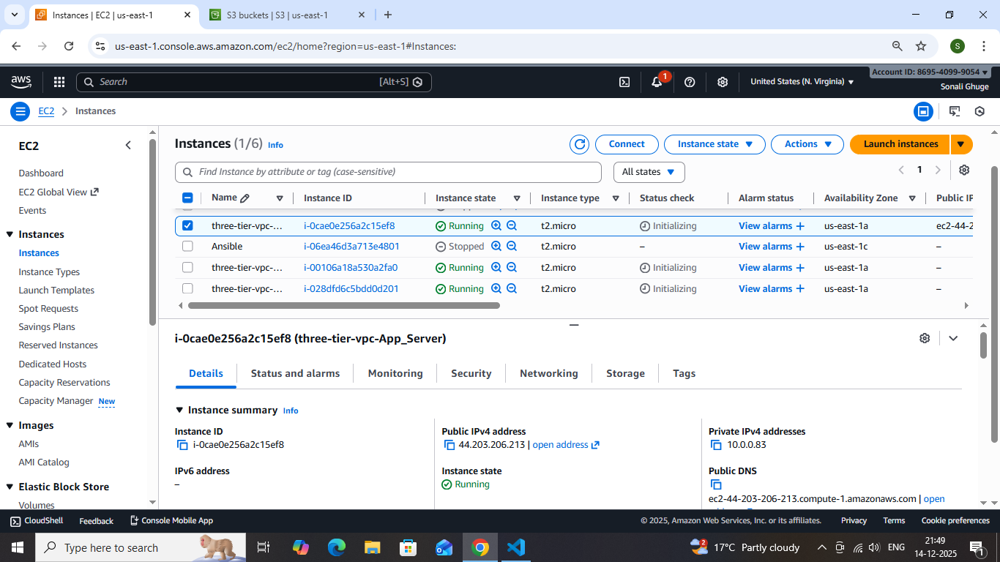
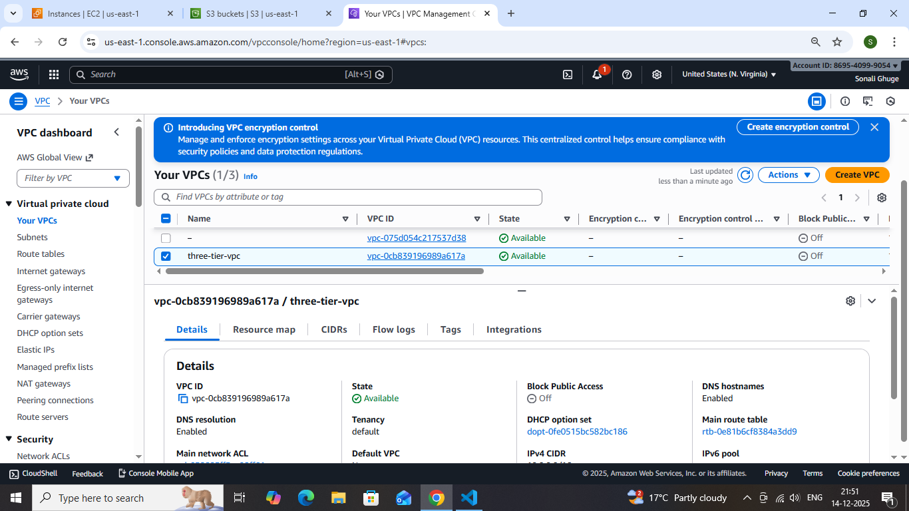
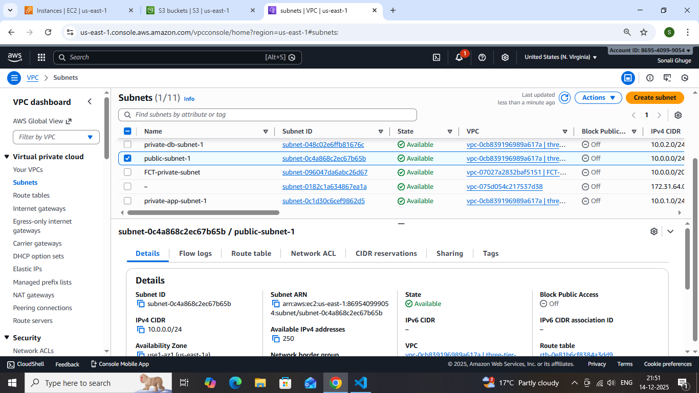
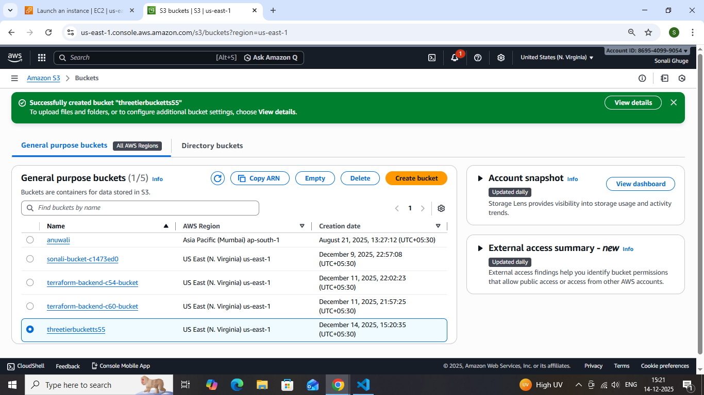

# 3tier-aritecture-project--using-terraform-

## Project Overview

This project demonstrates how to build a 3-Tier Architecture on AWS using Terraform. The architecture is divided into Presentation (Web), Application, and Database layers, each deployed in separate subnets to ensure high availability, scalability, and security.

## Architecture Diagram

## Architecture Components
### 1. Presentation Layer (Web Tier)

- Amazon EC2 instances

- Deployed in Public Subnets

- Application Load Balancer (ALB)

- Internet Gateway attached

### 2. Application Layer (App Tier)

- Amazon EC2 instances

- Deployed in Private Subnets

- Communicates with Web Tier

- Auto Scaling Group (optional)

### 3. Database Layer (DB Tier)

- Amazon RDS (MySQL / PostgreSQL)

- Deployed in Private Subnets

- No direct internet access

## Project Structure

       3-tier-architecture-terraform/
       │
       ├── main.tf
       ├── variables.tf
       ├── outputs.tf
       ├── README.md
       └── img/

## ☁️ AWS Services Used

- Amazon VPC

- Public & Private Subnets

- Internet Gateway

- NAT Gateway

- Application Load Balancer

- Amazon EC2

- Auto Scaling Group

- Amazon RDS

- Security Groups

- IAM

- Terraform

## Prerequisites

- AWS Account

- IAM User with required permissions

- Terraform installed 

- AWS CLI configured

## How to Deploy
Step 1. Initialize Terraform
       
       terraform init

 Step 2. Plan the Infrastructure

       terraform plan

Step 3. Apply the Configuration

      terraform apply

      

Step 4. Destroy 
         
         terraform destroy

 

## Outputs:

### 1. Ec2 Instances

### 2. Vpc

### 3. Subntes

### 4. Intenet Gateway

### 5. Security Group

### 6. S3 Bucket

## Security Features

- Private subnets for Application and Database tiers

- Least-privilege Security Groups

- Database not publicly accessible

- NAT Gateway for outbound internet access from private subnets

## Benefits of 3-Tier Architecture

- High Availability

- Scalability

- Improved Security

- Easy Maintenance

- Fault Isolation

## Conclusion

This project showcases how Terraform can be effectively used to provision and manage a secure, scalable, and highly available 3-tier architecture on AWS. By separating the Web, Application, and Database layers, the solution follows cloud best practices and mirrors real-world production environments.

## Author
Sonali Ghuge
